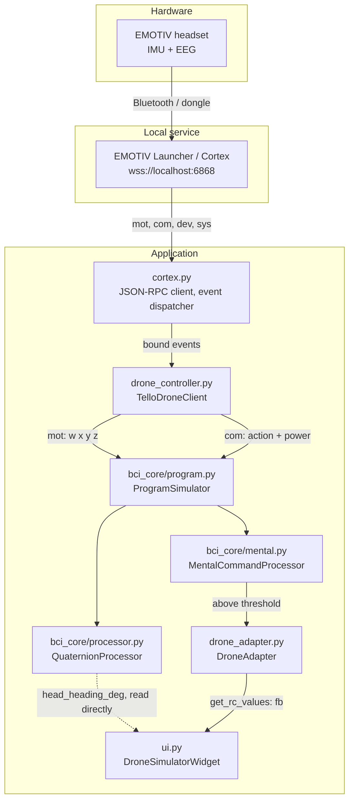

# How it works — a developer's guide

How a head turn and a thought become a drone on screen: the modules the data
passes through, the maths applied at each step, and what to read in the log when
it goes wrong.

For the player-facing flow and the reasoning behind the UI, see
[README.md](README.md). For the signal processing on its own, see
[bci_core/README.md](bci_core/README.md).

---

## 1. What the application actually is

A PyQt6 desktop app that reads an EMOTIV headset through the local Cortex
service and flies a simulated drone with it. One person wears the headset,
trains a mental command, and plays a 60-second ring run; the headset is then
handed to the next person.

Two inputs, and it is worth being precise about them because the code paths are
completely separate:

| Input | Cortex stream | Becomes | Path |
| :--- | :--- | :--- | :--- |
| Turning your head left/right | `mot` (quaternions) | The drone's **heading** | `QuaternionProcessor` → UI, direct |
| A trained mental command | `com` (command + power) | **Forward motion** | `MentalCommandProcessor` → `DroneAdapter` → RC |

Nothing else on the headset is an input. Head *tilt* is read from the stream and
deliberately discarded — see [section 4](#4-what-head-motion-does-not-do).

The real-drone path (Tello over WiFi) is intact in the tree but switched off at
`SHOW_REAL_DRONE` in `ui.py`. Everything below describes the simulator, which is
the product.

---

## 2. The pipeline



The dotted line is the part that surprises people. **Steering does not travel
through the RC channels.** `head_heading_deg` is a float on the processor that
the UI reads every frame via `_head_heading()`. The RC path carries only forward
motion from the mental command.

### Threading

`cortex.py` runs its websocket on its own thread, so every stream callback in
`drone_controller.py` arrives off the Qt main thread. Anything touching widgets
must marshal back through a `pyqtSignal` — `ui.py` declares one per concern
(`log_signal`, `bci_status_signal`, `dev_data_signal`, `ui_task_signal`, and so
on).

A `QTimer` created on a thread with no Qt event loop never fires. That is a real
bug this project has already had: `QTimer.singleShot(0, done)` from a worker
left the Refresh button permanently disabled. Both places that did it now go
through `ui_task_signal`.

Reading a plain float across threads (`head_heading_deg`) is fine — attribute
assignment is atomic under the GIL, and one frame of staleness is invisible at
32 Hz.

---

## 3. Steering: the head's angle *is* the heading

This is the most important thing to understand about the control model, and it
changed. Steering used to be a **rate**: your head angle set how fast the drone
rotated, and it kept rotating until you straightened up. That model is gone, for
two reasons worth knowing because both are easy to reintroduce:

- A rate has memory. Any standing offset — a calibration a couple of degrees
  out, a slowly drifting gyro — turned the drone continuously, forever.
- The output was quantised by an `int()` near the end. Measured end to end, the
  response was a staircase: nothing at all under 6°, then a jump to 6°/s, flat
  until 12°, then 15°/s. Six usable speeds across the whole comfortable range.

Now the head's angle maps straight onto the drone's heading. Look 20° right and
the drone points right and *stays* there; come back to centre and so does the
drone. Nothing accumulates.

### The maths, in order

All of this is `QuaternionProcessor._update_heading()` in
[bci_core/processor.py](bci_core/processor.py).

**1. Reference.** Calibration averages 60 frames and normalises, giving
`Q_cal`. It runs automatically on the first frames of a session, and again on
every **Recenter** and at the start of every run.

**2. Relative rotation.** `Q_rel = Q_curr * conj(Q_cal)`.

**3. Yaw, in degrees.**

```text
angle = degrees(2 * asin(clamp(Q_rel.z, -1, 1)))
```

`asin`, not the small-angle `2 * z` used elsewhere in the file, so a 40° look
reads as 40° instead of being quietly compressed.

**4. Inversion.** `invert_yaw` flips it. This is a property of the *headset*,
not the installation — only MN8 sets it, in `DEVICE_DEFAULTS`.

**5. Smoothing.** Moving average over `SmoothingWindow` (4) frames, in its own
deque. Deliberately separate from `_movement_buffer`: that one holds values
already scaled by sensitivity, and the average of scaled angles is not the
scaled average angle.

**6. Soft deadzone.** `head_deadzone_deg` (2°) is *subtracted*, not zeroed:

```text
centred = sign(a) * max(0, abs(a) - deadzone)
```

At the edge the output is 0 either way, so there is no step to fall off.

**7. Expo.** Shaped in normalised units so the curve is independent of gain —
full deflection still reaches full heading, only the path there changes:

```text
u       = clamp(centred * head_gain / head_limit_deg, -1, 1)
shaped  = expo * u**3 + (1 - expo) * u
heading = shaped * head_limit_deg
```

Expo is not cosmetic. Against a player model that moves its head gradually
toward each ring rather than snapping to the exact angle, the linear curve
overshoots and oscillates: 130 points over a 60-second run at `expo 0`, and
1310 at `expo 0.6`.

### What the shipped numbers give you

`head_gain 2.0`, `head_expo 0.8`, `head_deadzone_deg 2.0` — flown, not guessed:

| head held | drone heading |
| ---: | ---: |
| 5° | 1.2° |
| 10° | 3.4° |
| 20° | 9.8° |
| 30° | 21.0° |
| 40° | 39.6° |

### Drift, and why there is no drift correction

The headset's yaw estimate is a gyro integration with nothing pulling it back,
so it ramps. Measured on an INSIGHT2 with the wearer sitting still:
**1.81°/min**, monotonic, with 0.11° of noise around the trend.

That is harmless inside one run — it stays under the 2° deadzone for the whole
60 seconds — and only matters across a long session.

There *was* an alpha-beta tracker for it. It is off by default and should stay
off. A gate that only checks the size of the error cannot tell a slow ramp from
a small turn somebody is holding on purpose, and in a real session it learned
the steering instead: **+40°/min against a true 1.81**, walking its own zero out
to 28°, at which point the drone swung between the ±120° limits. Tightening the
gate to the deadzone and clamping the rate to 0.1°/s still reaches 9.3° of false
zero — the clamps are a floor on the damage, not a fix.

What actually solves it is **recentring at the start of every run**
(`_begin_timed_run` in `ui.py`). The countdown has just finished, so the player
is looking at the screen with their head where they mean it — the only moment in
the flow when "straight ahead" is known rather than estimated. Whatever the
previous player left behind goes with it, and there is no estimator to go wrong.

---

## 4. What head motion does *not* do

`DroneAdapter.move_by()` accepts `(dx, dy)` and holds every RC channel at zero.
It is kept only because the `bci_core` loop still calls it.

- **Tilt** never reaches the drone. Forward comes from the trained command, and
  since `MoveForward` is the default mapping, tilt could only ever have driven
  the drone *backwards* — through rings the player had just lined up, on an
  unconscious movement the on-screen instructions never mentioned.
- **Yaw** no longer produces an RC rate either. See section 3.

`ProgramSimulator.receive_motion()` still returns `(dx, dy)`, and
`drone_controller` still logs `dx`. Neither steers anything; they are diagnostic
leftovers of the rate model.

---

## 5. Mental commands

Cortex classifies continuously and emits `com` at roughly 8 Hz with an action
name and a power in `0.0` to `1.0`.

```text
com {action, power}
  -> ProgramSimulator.receive_mental()
  -> MentalCommandProcessor.process_command()   # threshold lookup
  -> DroneAdapter.execute_action(action, auto_release)
  -> get_rc_values()                            # ramp, expiry
  -> fb
```

**Threshold.** Per-command, from `mental_mappings` in `config.json`. Default
0.5. Below it nothing happens — and nothing *used* to be logged either, which
made an under-trained profile indistinguishable from a dead stream. Near misses
are now reported:

```text
[mental] 'push' peaked at 0.41, needs 0.50 -> not fired
```

**Default mapping.** `push` to `MoveForward`; `pull`, `lift` and `drop` to
`None`. Take-off and landing are not used — there is no drone to take off.

**Ramp.** A `Move*` action does not jump to full speed. `_mental_move_speed`
starts at 1.0 and gains 1.5 per `get_rc_values()` call up to 30, which is about
a second at the UI's 20 Hz.

**Expiry.** `auto_release` (default 1.0 s) after the last event. Cortex repeats
a held command many times a second and each repeat refreshes the timer, so
holding the thought holds the motion. Those refreshes are silent — logging them
buried the log under hundreds of identical lines per run.

---

## 6. Diagnostics

Everything printed goes to the in-window pane *and* to a file, because the
interesting failures happen on someone else's machine at an event.

| Where | What |
| :--- | :--- |
| `%APPDATA%\EmotivDrone\emotiv-drone.log` | Everything. 4 MB rollover, one previous kept. |
| `%APPDATA%\EmotivDrone\motion-capture.csv` | First 60 s of motion at full rate. One previous kept. |

From a checkout both sit beside the source instead. `applog.install_excepthook()`
redirects `sys.excepthook` into the file, so an unhandled exception in a
packaged build is recorded rather than vanishing into a console that does not
exist.

### `[pipe]` — the heartbeat

Every 5 seconds, every stage on one line:

```text
[pipe] mot 32Hz com 8Hz dev 2Hz | head -0.4deg -> heading +0.0deg |
       com [neutral:59% push:40%] fb=2 action=MoveForward | contact 5/5 battery 78%
```

One line rather than several, because the failures worth catching are relational
and only legible side by side:

| Symptom | Reading |
| :--- | :--- |
| `mot 32Hz` but heading never moves | data arriving, maths not converting it |
| `com [neutral:100%]` forever | Cortex classifying, profile never produces push |
| `com 0Hz` | the stream itself is dead |
| `action=MoveForward(7s ago)` | fired once, nothing since |
| `contact 2/5` | electrodes, not software |

It is driven from **all three** stream handlers. A heartbeat that only ticks on
motion data cannot report that motion data has stopped.

### `[stream]` — liveness

```text
[stream] mot first sample
[stream] com STALLED - nothing for 3.0s after 58 samples
[stream] com resumed
```

### `[steer]` — one line a second, carrying the peak of the window

```text
[steer] head +20.0deg right - deadzone 2.0 x gain 2.0 -> heading +54.0deg lost_to=none
```

`lost_to` names the gate that swallowed a turn: `still`, `deadzone` or `none`.
Every number on the line comes from the *same frame* — reporting the interval's
peak next to a later frame's arithmetic produced impossible lines, like a 14°
turn eaten by a 4° deadzone.

### `motion-capture.csv`

Full rate, for the questions a 1 Hz log cannot answer: is a fraction-of-a-degree
resting offset a fixed bias or a drift, and how noisy is the sensor really.

```text
t_sec,q0,q1,q2,q3,calibrated,raw_angle_deg,smoothed_angle_deg,heading_deg
```

Recording starts on the **first frame**, before calibration, so the settling
transient that poisons the captured centre is in the file. `time_source` on
`QuaternionProcessor` is injectable specifically so a capture can be replayed
through the real processor at any speed instead of only in real time — that is
how the drift figures in section 3 were measured rather than guessed.

---

## 7. Configuration

Two files in `app_paths.user_data_dir()`, split by `config_manager.py`:

- **`config.json`** — everything tunable.
- **`credentials.json`** — Cortex client id and secret. Git-ignored. The app
  ships with none and asks on first launch; once Launcher approves them they are
  saved and never asked for again.

`load_config()` merges `DEFAULT_CONFIG`, overlays the file, runs `migrate()` and
**writes the result back**. That last part matters: a machine that once ran an
older build has that build's defaults on disk, and changing `DEFAULT_CONFIG`
alone will never reach it. Anything you want to change for existing installs
needs a migration.

`migrate()` is deliberately conservative — it only replaces values that exactly
match a previous default, on the grounds that anything else is somebody's
choice. It currently handles legacy mental mappings, empty device profiles, a
stale top-level `invert_yaw`, an inert deadzone, the pre-tuning steering
defaults, and turning drift correction off.

### The settings a developer actually reaches for

| Key | Default | Effect |
| :--- | ---: | :--- |
| `head_gain` | 2.0 | Degrees of heading per degree of head, before expo. |
| `head_expo` | 0.8 | 0 linear, 1 cubic. Raise for a calmer centre; lower `head_gain` for less turn everywhere. |
| `head_deadzone_deg` | 2.0 | Subtracted, not zeroed. |
| `head_drift_correction` | `false` | Leave it off. Section 3. |
| `motion_capture_seconds` | 60 | 0 disables the CSV. |
| `mental_mappings[].threshold` | 0.5 | Lower it for weakly trained profiles. |

`DEVICE_DEFAULTS` holds per-model overrides keyed by the id prefix
(`INSIGHT2-...` gives `INSIGHT2`). Put anything headset-specific there, never at
the top level — a top-level `invert_yaw` is inherited by every headset without
its own profile, which is how tuning an MN8 silently inverted Insight and
EPOC X.

### Feature flags, top of `ui.py`

| Flag | Default | Off means |
| :--- | :--- | :--- |
| `SHOW_REAL_DRONE` | `False` | Tello setup and flight dashboard unreachable. Pages stay registered; indices unchanged. |
| `SHOW_PROFILE_LIST` | `False` | Each player types a name instead of picking a past profile. |
| `SHOW_MOTION_TUNING` | `False` | No Configurations dialog. Recenter is the only motion control. |
| `COINS_STRAIGHT_AHEAD` | `True` | Rings spawn dead ahead instead of off-axis. A stopgap from when steering was broken — set `False` for the real game. |
| `RUN_SECONDS` | `60` | Run length. |

---

## 8. Cortex, and the parts that bite

`cortex.py` is a JSON-RPC client over `wss://localhost:6868`, validating against
the bundled `certificates/rootCA.pem`. Each request type has a fixed id and
replies are dispatched on it, so **reusing an id across two methods sends the
reply down the wrong branch** — which is how a `closeSession` once got handled
as a `createSession` and returned `-32007`.

### Profiles

A headset holds **one** profile, and whoever loaded it keeps it. Going straight
to `setupProfile` fails twice over: `load` returns `-32127` ("a profile is
already loaded"), and training against the survivor returns `-32046` ("loaded by
another application").

`prepare_profile(name, action)` handles this: ask `getCurrentProfile`, unload
whatever is there **by the name Cortex reported** (unloading a name that is not
the loaded one is a silent no-op), then resume the queued create or load from
the unload reply. A refused unload drops the pending action rather than leaving
the UI waiting on an event that is never coming.

### Types on the wire

Cortex sends `signal` as a float. PyQt does not round when handing a float to an
`int` signal — it produced `-998818480`, which read as "Unknown" and disabled
the Start Training button. Coerce at the point of entry.

`OVERALL` rides in the contact-quality array and is **not an electrode**.
Counting it makes a five-sensor Insight report `5/6` and drags any average
toward a channel that is always perfect.

---

## 9. Building

```bash
pip install -r requirements.txt pyinstaller
pyinstaller packaging/EmotivDrone.spec --noconfirm   # -> dist/
iscc packaging/EmotivDrone.iss                       # -> setup.exe at the root
```

Windows only in practice; a build targets the OS it runs on. `onedir`, not
`onefile` — a single-file build of a PyQt6 + OpenCV + PyAV app unpacks itself to
`%TEMP%` on every launch, costing 10 to 20 seconds of cold start.

Pass `/DAppVersion=1.2.1` to `iscc` or it stamps `0.0.0`. The installer is
per-user, so it needs no administrator rights.

`config.json` and `credentials.json` are **not** in the installer — they live in
the user data directory. A tuned machine's feel does not travel with the build,
so anything that should be everyone's default belongs in `DEFAULT_CONFIG` with a
migration, not in your local file.

To verify a build really contains what you just committed, read the symbols back
out of the shipped executable rather than trusting its timestamp —
`PyInstaller.archive.readers` will open both the outer archive and the inner
PYZ.

---

## 10. Where to start reading

| To understand | Read |
| :--- | :--- |
| Stream to action, end to end | `drone_controller.TelloDroneClient.on_new_mot_data` and `on_new_com_data` |
| The steering maths | `bci_core/processor.QuaternionProcessor._update_heading` |
| Why the drone moves forward | `drone_adapter.DroneAdapter.get_rc_values` |
| How the scene is driven | `ui.DroneSimulatorWidget.update_rc` |
| Cortex lifecycle and errors | `cortex.Cortex.handle_result` |
| What a session did | the log, `[pipe]` first |
