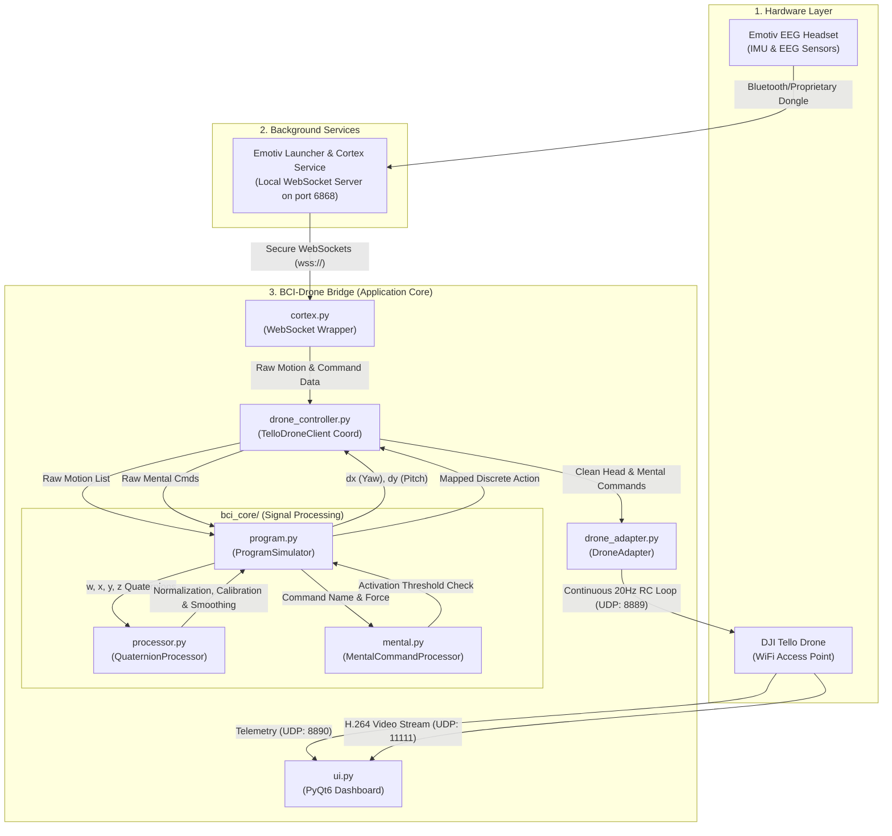

# 🧠 Emotiv Drone: BCI-Powered Flight Control Guide

Welcome to the comprehensive guide for the **Emotiv Drone** project. This document provides an in-depth explanation of how the system functions, the underlying signal processing algorithms, the software architecture, connection protocols, and a detailed step-by-step guide to setting up and operating the interface.

---

## 📌 1. System Overview & Data Flow

This application is a Brain-Computer Interface (BCI) designed to control a **DJI Tello** drone using a combination of **head gestures (motion tracking)** and **mental commands (cognitive actions)** captured by an **Emotiv EEG headset** (e.g., Insight, EPOC, EPOC+, or EPOC X).

### 🔄 The Architecture & Connection Pipeline

Below is the architectural data flow showing how electrical brain signals and head movements are captured, processed, and translated into physical drone actions:



---

## ⚙️ 2. Core Code Components

The project is structured into modular components, each with a single responsibility:

| Component | File Path | Primary Responsibility |
| :--- | :--- | :--- |
| **GUI Dashboard** | [ui.py](file:///Users/giovaniflorek/src/emotiv-drone/ui.py) | PyQt6-based user interface displaying video feed, telemetry, and setup wizard. Runs the drone simulator. |
| **Cortex API Wrapper** | [cortex.py](file:///Users/giovaniflorek/src/emotiv-drone/cortex.py) | Establishes the WebSocket connection to the local Emotiv Cortex Service, authenticates, and subscribes to raw streams. |
| **Drone Client Coordinator** | [drone_controller.py](file:///Users/giovaniflorek/src/emotiv-drone/drone_controller.py) | Integrates the Cortex stream callbacks with the signal processors and translates updates to the drone adapter. |
| **Motion Processor** | [bci_core/processor.py](file:///Users/giovaniflorek/src/emotiv-drone/bci_core/processor.py) | Converts raw quaternions to Euler angles, recalibrates center baseline, filters out noise, and smooths output. |
| **Mental Command Processor** | [bci_core/mental.py](file:///Users/giovaniflorek/src/emotiv-drone/bci_core/mental.py) | Evaluates cognitive command strengths against user-defined activation thresholds. |
| **Drone Adapter** | [drone_adapter.py](file:///Users/giovaniflorek/src/emotiv-drone/drone_adapter.py) | Accumulates control velocities and runs a background thread that continuously sends RC control packets at 20Hz to Tello. |
| **Configuration Manager** | [config_manager.py](file:///Users/giovaniflorek/src/emotiv-drone/config_manager.py) | Manages system settings (`config.json`) and security credentials (`credentials.json`). |

---

## 📈 3. Mathematical Signal Processing & Algorithms

Understanding how a head movement or thought becomes a control command is key to master this system.

### A. Head Tracking Algorithm (`QuaternionProcessor`)
The headset's Inertial Measurement Unit (IMU) streams spatial rotation in **Quaternions** ($w, x, y, z$). This format avoids the "gimbal lock" issue associated with Euler angles.

1. **Calibration (Zeroing)**:
   When you request a calibration (e.g., via the dashboard or automatically during first frame), the system averages 60 incoming quaternion samples to calculate a baseline neutral orientation ($Q_{cal}$).
   $$Q_{cal} = \text{Normalize}\left(\sum_{i=1}^{60} Q_i\right)$$

2. **Relative Orientation**:
   For any current headset quaternion $Q_{curr}$, the relative rotation $Q_{rel}$ representing deviation from the calibrated baseline is:
   $$Q_{rel} = Q_{curr} \times Q_{cal}^*$$
   *(where $Q_{cal}^*$ is the quaternion conjugate)*.

3. **Pitch & Yaw Extraction**:
   From the relative quaternion, pitch (forward/back tilt) and yaw (left/right turn) are extracted:
   $$\text{Relative Pitch} = 2 \times Q_{rel}.x$$
   $$\text{Relative Yaw} = 2 \times Q_{rel}.z$$

4. **Deadzone & Sensitivity Scaling**:
   To prevent drone drift due to involuntary neck muscle twitches, a deadzone is applied (default `0.03`). If the absolute value is below the deadzone, it is forced to `0.0`.
   If above the deadzone, the values are scaled using independent directional sensitivities (e.g., `sens_left`, `sens_right`, `sens_fwd`, `sens_back`):
   $$raw\_x = \text{Relative Yaw} \times \text{Sensitivity}_{horizontal} \times \text{BaseSensitivity}$$
   $$raw\_y = -\text{Relative Pitch} \times \text{Sensitivity}_{vertical} \times \text{BaseSensitivity}$$

5. **Moving Average Smoothing**:
   A moving average deque of size `6` acts as a low-pass filter to smooth raw output, generating a stable $dx$ and $dy$ value.

6. **Mapping to Tello RC Commands**:
   The final $(dx, dy)$ are passed to `DroneAdapter.move_by()`, which translates them into standard pitch (forward/backward speed) and yaw (rotation speed) parameters clamped to the $[-max\_speed, +max\_speed]$ range.

---

### B. Mental Command Processing (`MentalCommandProcessor`)
EEG sensor readings are processed locally by the Emotiv Cortex Engine, which outputs a stream of detected mental states (such as `push`, `pull`, `lift`, `drop`) paired with a strength/power score (ranging from `0.0` to `1.0`).

1. **Threshold Filtering**:
   When a command arrives, the `MentalCommandProcessor` retrieves the threshold configured for that command (default: `0.5` - `0.7`). If the strength is below the threshold, the command is ignored.
2. **Action Execution**:
   If above threshold, it triggers a discrete command (e.g. `TakeOff`, `Land`, `EmergencyStop`) or a progressive action like `MoveForward`.
3. **Smooth Speed Ramping**:
   For mental movement actions (e.g., `MoveForward`), the system ramps up the drone speed gradually (e.g., adding `1.5` per RC update tick up to a max of `30`) to avoid sudden acceleration.
4. **Auto-Release Timer**:
   To prevent the drone from moving indefinitely, an auto-release time is set (e.g. `1.0` second). Once this timer expires, the movement is automatically zeroed out unless the user sustains the mental command.

---

## 📡 4. Data Protocols & Network Architecture

```
                  ┌──────────────────────┐
                  │ Emotiv Cortex Engine │
                  └──────────┬───────────┘
                             │ (wss://localhost:6868)
                             ▼
┌──────────────┐  Secure WebSocket (JSON-RPC 2.0)  ┌───────────────────┐
│ DJI Tello AP │ ◄─────────────────────────────────┤   Your Computer   │
└──────┬───────┘                                   └─────────┬─────────┘
       │                                                     │
       ├─ (UDP:8889) ── Sent RC Command Control Packets ◄────┤ (Client)
       ├─ (UDP:8890) ── State Telemetry Data Streams ────────►┤
       └─ (UDP:11111) ─ H.264 Camera Video Frames ───────────►┘
```

The system uses two separate networks concurrently:

1. **Emotiv Connection (Local secure connection)**:
   * **Medium**: Secure WebSocket over SSL/TLS (`wss://localhost:6868`).
   * **Authentication**: Emotiv Cortex uses JSON-RPC 2.0. The application submits client ID, client secret, requests a session, and loads the active training profile.
   * **Security Certificate**: Standard connection requires the Emotiv local SSL certificate. The project includes `certificates/rootCA.pem` to establish validation.

2. **Drone Connection (Dedicated WiFi connection)**:
   * **Medium**: Direct WiFi Link. The DJI Tello acts as an Access Point (SSID: `TELLO-XXXXXX`).
   * **Protocol**: UDP socket communication over the Tello SDK.
     * **Port 8889 (Command Port)**: Sends commands (`takeoff`, `land`, `rc lr fb ud yaw`) and receives `ok`/`error` responses.
     * **Port 8890 (State Port)**: Listens for incoming telemetry text strings containing battery, height, flight time, and temperature.
     * **Port 11111 (Video Stream)**: Listens for H.264 encoded raw video stream packets decoded in real time by OpenCV.

---

## 🚀 5. How to Run the System

Follow this step-by-step setup to launch the application.

### A. Prerequisites
* **Hardware**:
  * Emotiv Headset (charged and fitted).
  * DJI Tello Drone (charged battery).
  * Computer with WiFi capability.
* **Software**:
  * **Emotiv Launcher** (Download, log in, and ensure it runs in the background).
  * **Python 3.8+** installed.

### B. Installation
1. **Clone the repository**:
   ```bash
   git clone https://github.com/giovaniemotiv/emotiv-drone.git
   cd emotiv-drone
   ```
2. **Set up the Virtual Environment**:
   ```bash
   python3 -m venv venv
   source venv/bin/activate
   pip install -r requirements.txt
   ```

### C. Launching the App
Run the launcher script:
```bash
./run.sh
```
*(This activates the virtual environment and starts `ui.py`)*

### D. Step-by-Step UI Setup Wizard

#### Step 1: BCI Setup
1. Open the UI. You will see the **BCI Setup** page.
2. If testing without hardware, check **Simulate Mode**. This creates mock headset signals and runs the built-in 3D-like simulation arena.
3. Fill in your **Emotiv Client ID** and **Client Secret**.
   * *Note: The first time you launch, entering these will automatically generate a git-ignored `credentials.json` to keep your credentials secure.*
4. Click **"Connect to Emotiv"**.
5. **Grant App Access**: If you are running the app for the first time, a prompt will appear in the **Emotiv Launcher** asking you to approve the connection. Confirm the access grant.
6. Once connected, your headset profile list will populate. Choose your trained profile (e.g., `giovani`) to load your custom mental command configurations.

#### Step 2: Test Controls
1. This screen allows you to check if head gestures are calibrated properly.
2. Put on the headset, look straight ahead at your monitor in a neutral, relaxed position, and click **"Reset Head Center"** (or **"Calibrate Neutral"**). Keep still for 3 seconds while the system records the average orientation.
3. Tilt your head forward/backward and rotate left/right. You will see a head visualizer or a mock drone indicator react to your movements.
4. Test your mental commands. Perform trained thoughts (e.g., focus on a "push" command). Ensure the command power bar surpasses the defined threshold.

#### Step 3: Connect to DJI Tello
1. Turn on your DJI Tello drone and wait for its indicator light to blink yellow.
2. On your computer, open your Wi-Fi settings and connect to the network starting with `TELLO-` (e.g., `TELLO-8E4B1C`).
3. Return to the application dashboard and click **"Connect to Drone"**.
4. The dashboard will ping the drone on UDP port 8889. Once connected, telemetry indicators will light up, and the live video stream thread will start.

#### Step 4: Flight Dashboard
1. You are now ready to fly!
2. Click **"Take Off"** (or trigger your trained mental command for Take Off, default: `Push`).
3. Tilt your head to navigate.
4. Maintain a relaxed focus to trigger mental actions (like Flipping or landing).
5. Use the **Emergency Stop** button or the **Land** button at any time to halt operations instantly.

---

## 🔒 6. Settings & Configuration Management

We separate settings into two configuration files under the project root:

1. **`config.json`** (Tracked in Git)
   Stores settings you might want to share with others, like sensitivity, deadzone threshold, smoothing window, and mental command mapping:
   ```json
   {
       "device_id": "",
       "profile_name": "giovani",
       "simulate": false,
       "fix_indices": false,
       "sensitivity": 0.5,
       "deadzone": 0.02,
       "smoothing_window": 4,
       "max_speed": 60,
       "altitude_hold": true,
       "mental_mappings": [
           {
               "command": "push",
               "action": "TakeOff",
               "threshold": 0.6,
               "auto_release": 0
           },
           {
               "command": "pull",
               "action": "Land",
               "threshold": 0.6,
               "auto_release": 0
           }
       ]
   }
   ```
2. **`credentials.json`** (Ignored by `.gitignore`)
   Contains your private credentials. **Do not share this file**:
   ```json
   {
       "client_id": "YOUR_CLIENT_ID",
       "client_secret": "YOUR_CLIENT_SECRET"
   }
   ```

*The `ConfigManager` automatically splits and merges these files at startup and shutdown.*

---

## ⚠️ 7. Safety Guidelines

Flying a drone with a brain-computer interface requires safety protocols to protect yourself, others, and the drone:

1. **Simulate First**: Always run the application in **Simulation Mode** first to verify that your head movements are translating properly and that you understand the control mappings.
2. **Clear Flight Space**: Fly in an open indoor space (minimum 3m x 3m) away from obstacles, pets, fragile objects, or people. Do not fly the drone outdoors in windy conditions.
3. **Calibrate Neutral Position**: Before taking off, ensure you do a **Reset Head Center** while looking straight ahead. This prevents the drone from drifting immediately upon takeoff.
4. **Emergency Controls**:
   * Keep your hand near your mouse/keyboard. The big red **Emergency Stop** button instantly cuts the drone's motors (causing it to drop).
   * Turning off the application or losing connection automatically prompts the Tello drone to land safely.
   * If the drone is moving out of control, a quick manual override or closing the UI window is the fastest way to trigger land.

---

*Developed with ❤️ for BCI and drone enthusiasts.*
